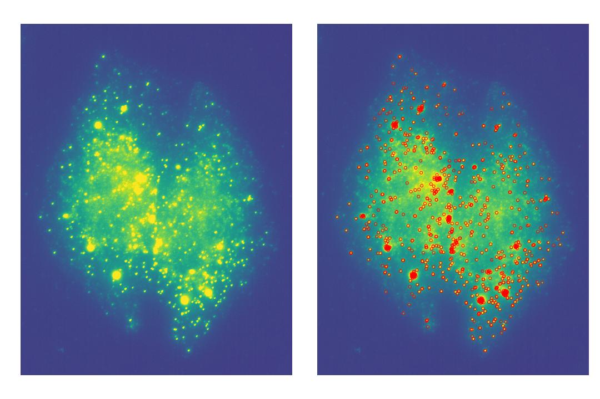

# Methods, plots and results from Chouaib et al. (2020)

This repository gathers the code used to explore and analyze a large part of the images from the following paper:

__Title:__ A localization screen reveals translation factories and widespread co-translational protein targeting

__Authors:__ Racha Chouaib<sup>1,2,3,11,+</sup>, Adham Safieddine<sup>1,2,3,+</sup>, Xavier Pichon<sup>1,2,+</sup>, Arthur Imbert<sup>4,5,6,+</sup>, Oh Sung Kwon<sup>7</sup>, Aubin Samacoits<sup>8,9</sup>, Abdel-Meneem Traboulsi<sup>1,2</sup>, Marie-Cécile Robert<sup>1,2</sup>, Nikolay Tsanov<sup>1,2</sup>, Emeline Coleno<sup>1,2</sup>, Ina Poser<sup>10</sup>, Christophe Zimmer<sup>8,9</sup>, Anthony Hyman<sup>10</sup>, Hervé Le Hir<sup>7</sup>, Kazem Zibara<sup>3,11</sup>, Marion Peter<sup>1,2</sup>, [Florian Mueller](mailto:muellerf.research@gmail.com)<sup>8,9,* </sup>, [Thomas Walter](mailto:thomas.walter@mines-paristech.fr)<sup>4,5,6,* </sup>, [Edouard Bertrand](mailto:edouard.bertrand@igmm.cnrs.fr)<sup>1,2,*</sup>

><sup>1</sup>Institut de Génétique Moléculaire de Montpellier, University of Montpellier, CNRS, Montpellier, France
<sup>2</sup>Equipe labélisée Ligue Nationale Contre le Cancer, University of Montpellier, CNRS, Montpellier, France
<sup>3</sup>ER045, PRASE, DSST, Lebanese University, Beirut, Lebanon
<sup>4</sup>MINES ParisTech, PSL-Research University, CBIO-Centre for Computational Biology, 77300 Fontainebleau, France
<sup>5</sup>Institut Curie, 75248 Paris Cedex, France
<sup>6</sup>INSERM, U900, 75248 Paris Cedex, France
<sup>7</sup>Institut de biologie de l'Ecole normale supérieure (IBENS), Ecole normale supérieure, CNRS, INSERM, PSL Research University, 46 rue d'Ulm, 75005, Paris, France
<sup>8</sup>Unité Imagerie et Modélisation, Institut Pasteur and CNRS UMR 3691, 28 rue du Docteur Roux, 75015 Paris; France
<sup>9</sup>C3BI, USR 3756 IP CNRS – Paris, France
<sup>10</sup>MPI-CBG, Pfotenhauer Str. 108, 01307 Dresden, Germany
<sup>11</sup>Biology Department, Faculty of Sciences-I, Lebanese University, Beirut, Lebanon
>
><sup>+</sup>Equal contributions
<sup>*</sup>To whom correspondence should be addressed.

This paper provides qualitative and quantitative evidence on the single-cell level about the non-random mRNA localization of in the cytoplasm. More specifically it emphasizes the **co-localization of several mRNAs with their encoded proteins** and the fact that **some mRNAs are translated in dedicated factories**.

## Data

The entire dataset consists of 527 images for 32 different genes. For each image,
3 channels were acquired:
- DAPI: label nuclei.
- smFISH (Cy3): visualize individual mRNA molecules of the genes of interest.
- GFP: visualize the encoded protein.

Each image is stored as a 4D tensor (first dimension for the different channels, next three dimension for the 3 spatial dimensions).

Ultimately, we identified 9710 cells within these images.

| 2D projection of dapi channel | 2D projection of FISH channel |
| ------------- | ------------- |
|  |  |

If you have any question related to the image acquisition, please contact [Edouard Bertrand](mailto:edouard.bertrand@igmm.cnrs.fr)

## Prerequisites

The analysis pipeline consists of three different resources that are best run
in dedicated virtual environments:
- **BigFISH**, a python library to process smFISH images (available in this
  repository). It allows to perform segmentation of cells and nuclei, detect mRNA
  molecules in 3D, and lastly compute spatial features at the cell-level.
    - Run the command `pip install -r requirements_bigfish.txt` in an empty virtual environment to reproduce our python environment and run BigFISH methods.
- [**NucleAIzer**](http://nucleaizer.org/), a Deep Learning based approach for nuclei segmentation. We modified
   the published open-source code to adjust it to our specific needs .
    - Run the command `pip install -r requirements_nucleAIzer.txt` in an empty virtual environment to reproduce our python environment and run nucleAIzer model.
- A more general environment with classic data science libraries to train classification models, perform statistical tests and plot results. We use it as a kernel for the final Ipython notebook _results.ipynb_.
    - Run the command `pip install -r requirements_general.txt` in an empty virtual environment to reproduce our python environment and run the _results.ipynb_ notebook.

## Pipeline

Below, we provide a quick overview of the different steps in the analysis, and
in which environment they are performed. A more detailed description of each
step is provided in the following sections:

1. **Project 3D DAPI and FISH channels to 2D** (BigFISH)
2. **Filter FISH images** (BigFISH)
3. **Segment nuclei** (NucleAIzer)
4. **Segment cells** (BigFISH)
5. **Detect mRNAs spots** (BigFISH)
6. **Extract individual cells** (BigFISH)
7. **Compute spatial features** (BigFISH)
8. **Train classification models** (general)
9. **Compute and visualize results** (general)


If you have any question relative to the image analysis, please contact [Florian Mueller](mailto:muellerf.research@gmail.com) or [Thomas Walter](mailto:thomas.walter@mines-paristech.fr) (or open an issue).

### 1. Projections
Nuclei and cell segmentation is performed on 2D images. To obtain these images,
we project the 3D images stored in the 4D tensor with an approach based on focus-Projections
as detailed [in our paper](https://academic.oup.com/nar/article/44/22/e165/2691336):

#### Projection of DAPI image**
Resulting image is named `nuc_focus`.

```python
import bigfish.stack as stack

# nuc : np.ndarray, np.uint
#   3-d dapi image with shape (z, y, x).

# focus projection and enhanced contrast for the dapi channel
nuc_focus = stack.focus_projection_fast(
    tensor=nuc,
    proportion=0.7,
    neighborhood_size=7)
nuc_focus = stack.rescale(
    tensor=nuc_focus,
    channel_to_stretch=0)
```


#### Projection of smFISH image**
Resulting image is named `cyt_focus`.

```python
# cyt : np.ndarray, np.uint
#   3-d FISH image with shape (z, y, x).

# focus projection for FISH channel
cyt_focus = stack.focus_projection_fast(
    tensor=cyt,
    proportion=0.75,
    neighborhood_size=7)

# maximum intensity projection for FISH channel
cyt_in_focus = stack.in_focus_selection(
    image=cyt,
    proportion=0.80,
    neighborhood_size=30)
cyt_mip = stack.maximum_projection(cyt_in_focus)
```


### 2. Filtering

We apply two filters on the FISH channel `cyt` to facilitate the spot detection:
- a Laplacian of Gaussian filter to enhance the signal-to-noise ratio of the spots and denoise the image (`cyt_filtered_log`).
- a large Gaussian filter to estimate the background noise we then remove from the original image (`cyt_filtered_background`).

```python
import bigfish.stack as stack
import bigfish.detection as detection

# cyt : np.ndarray, np.uint
#   3-d FISH image with shape (z, y, x).

# get sigma value for gaussian filters
sigma_z, sigma_yx = detection.get_sigma(
    resolution_z=300,
    resolution_yx=103,
    psf_z=350,
    psf_yx=150)
sigma_log = (sigma_z, sigma_yx, sigma_yx)
sigma_background = (sigma_z*5, sigma_yx*5, sigma_yx*5)

# LoG filter
cyt_filtered_log = stack.log_filter(
    image=cyt,
    sigma=sigma_log,
    keep_dtype=True)

# large gaussian filter to estimate then remove noisy background
cyt_filtered_background = stack.remove_background_gaussian(
    image=cyt,
    sigma=sigma_background)
```

### 3. Nuclei segmentation

We identify and segment nuclei from the 2D focus projection of the DAPI channel.
For this, we use modified and light-weight version of [**NucleAIzer**](http://nucleaizer.org/).
From the original [source code](https://github.com/spreka/biomagdsb) we kept:
- their final segmentation scripts based on Matterport's Mask R-CNN [implementation](https://github.com/matterport/Mask_RCNN).
- their final trained [weights](https://drive.google.com/drive/folders/1lVJtS41vzMkIsCa3-i14mSmLBbaKazsq).

In particular, we removed the Matlab dependencies and the post-processin steps with
several U-nets. We found that these steps didn't not improve the segmentation quality
of our data.

#### NucleAIzer

To segment nuclei with our version of NucleAIzer:

1. Reproduce our python environment:
    - If you use conda, you can recreate our conda environment with the command `conda env create -f environment_nucleAIzer.yml`.
    - Otherwise, you can reproduce it manually from the _requirements_nucleAIzer.txt_ file, running the command `pip install -r requirements.txt` in an empty virtual environment.

2. Download the trained weights from the [google drive](https://drive.google.com/drive/folders/1lVJtS41vzMkIsCa3-i14mSmLBbaKazsq) of the authors. Make sure to copy the _mask_rcnn_final.h5_ file in the folder _nucleAIzer/biomagdsb/kaggle_workflow/maskrcnn/model_.

3. Copy the 2D DAPI projections in the folder _nucleAIzer/biomagdsb/testImages_.

4. Run the command `bash nucleAIzer/biomagdsbstart_prediction_fast.sh`.

5. Get the masks in the folder _nucleAIzer/biomagdsb/kaggle_workflow/outputs/presegment_.


#### Two-round segmentation

For most of our images, the nuclei segmentation from NucleAIzer works well. For some challenging images, where NucleAIzer misses some nuclei, a second pass helps. We use BigFISH to remove the segmented nuclei from the image (`unsegmented_nuclei`) before applying NucleAIzer a second time.

```python
import bigfish.segmentation as segmentation

# nuc_focus : np.ndarray, np.uint
#   2-d projection of dapi image with shape (y, x).
# nuc_mask : np.ndarray
#   Results of the nuclei segmentation, with shape (y, x).

# remove the nuclei we have already segmented in the image
unsegmented_nuclei = segmentation.remove_segmented_nuc(
    image=nuc_focus,
    mask=nuc_mask)
```

Finally, you can properly merge the two masks `nuc_mask_1`  and `nuc_mask_2`.

```python
import bigfish.segmentation as segmentation

# nuc_mask_1 : np.ndarray,
#   Results of the first nuclei segmentation, with shape (y, x).
# nuc_mask_2 : np.ndarray,
#   Results of the second nuclei segmentation, with shape (y, x).

# merge results of two successive segmentations
nuc_mask = segmentation.merge_labels(label_1=nuc_mask_1, label_2=nuc_mask_2)
nuc_mask = segmentation.dilate_erode_labels(label=nuc_mask)
```

### 4. Cell segmentation

Based on the 2D projection of the FISH channel `cyt_focus` and the results of the nuclei segmentation `nuc_mask`, we apply a watershed algorithm to segment cells in `cyt_mask`. A `threshold` is required to discriminate the average pixel intensity of the cell from the background.

```python
import bigfish.segmentation as segmentation

# cyt_focus : np.ndarray, np.uint
#   2-d projection of FISH image with shape (y, x).
# threshold : int
#   Intensity pixel threshold to discriminate foreground (cells) from
#   background
# nuc_mask : np.ndarray
#   Result of the nuclei segmentation with shape (y, x).

# compute binary mask
mask = segmentation.build_cyt_binary_mask(
    image_projected=cyt_focus,
    threshold=threshold)
mask[nuc_mask > 0] = True

# compute relief
relief = segmentation.build_cyt_relief(
    image_projected=cyt_focus,
    nuc_labelled=nuc_mask,
    mask_cyt=mask,
    alpha=0.99)

# cell segmentation with watershed-based algorithm
cyt_mask = segmentation.cyt_watershed(
    relief=relief,
    nuc_labelled=nuc_mask,
    mask=mask,
    smooth=7)
```


### 5. mRNAs detection

To accurately detect the individual mRNA molecules in 3D, three steps are necessary:
1. Local maximum detection to detect individual and isolated spots (`spots`). The initial detection is based on the filtered image `cyt_filtered_log`.
0. A modified Gaussian Mixture Model to estimate the  number of mRNA molecules in the bright and dense areas and decompose them (`spots_out_cluster` and `spots_in_cluster`). The detection of these dense areas is based on the filtered image `cyt_filtered_background` with a connected-component labeling algorithm.
0. Clustering algorithm to gather spots in close proximity (`clustered_spots`) and define them as foci (`foci`).

#### Spot detection

```python
import bigfish.detection as detection

# cyt_filtered_log : np.ndarray, np.uint
#   LoG filtered image with shape (z, y, x) or (y, x).
# threshold : int
#   Minimum threshold of a spot in the LoG filtered image to be kept.

# get sigma value for gaussian filters
sigma_z, sigma_yx = detection.get_sigma(
    resolution_z=300,
    resolution_yx=103,
    psf_z=350,
    psf_yx=150)
sigma = (sigma_z, sigma_yx, sigma_yx)

# detect spots
mask_lm = detection.local_maximum_detection(
    image=cyt_filtered_log,
    minimum_distance=2)
spots, radius, _ = detection.spots_thresholding(
    image=cyt_filtered_log,
    sigma=sigma,
    mask_lm=mask_lm,
    threshold=threshold)
```

Detected spots are shown as red circles in the right image. Note that even brighter spots are only detected once, even if they likely contain multiple RNAs. The next steps allows to decompose these brighter spots.


#### Cluster decomposition

```python
import bigfish.detection as detection
import numpy as np

# cyt_filtered_background : np.ndarray
#   Image with shape (z, y, x) and filter with a large gaussian operator to
#   estimate then remove background.
# spots : np.ndarray, np.int64
#   Coordinates of the detected spots with shape (nb_spots, 3).
# radius : Tuple[float]
#   Radius of the detected spots, one value for each dimension.

# cluster decomposition
(spots_out_cluster, spots_in_cluster, _, _) = detection.run_decomposition(
    image=cyt_no_background,
    spots=spots,
    radius=radius,
    min_area=2,
    resolution_z=300,
    resolution_yx=103,
    psf_z=350,
    psf_yx=150)
spots = np.concatenate((spots_out_cluster, spots_in_cluster[:, :3]), axis=0)
```

Please note that multiples spots are now placed in the brighter area.



#### Foci detection

```python
import bigfish.detection as detection

# spots : np.ndarray, np.int64
#   Coordinates of the detected spots with shape (nb_spots, 3).

# detect foci
clustered_spots = detection.cluster_spots(
    spots=spots,
    resolution_z=300,
    resolution_yx=103,
    radius=350,
    nb_min_spots=5)
foci = detection.extract_foci(clustered_spots=clustered_spots)
```

Foci are detected with DBscan, where points are grouped together that are closer than
350nm. Further, to be considered a foci has to have at least 5 mRNAs. Detected foci
are shown as blue circles.


### 6. Postprocessing and cell extraction

Foci detected inside the nuclei (and their mRNAs) are defined
as transcription sites and filtered out (`spots_in_foci_cleaned` and `foci_cleaned`).

```python
import bigfish.stack as stack

# nuc_mask : np.ndarray
#   Results of the nuclei segmentation, with shape (y, x).
# clustered_spots : np.ndarray, np.int64
#   Coordinates of the detected spots with shape (nb_spots, 4). The last
#   column is the cluster assigned to the spot. If no cluster was assigned,
#   value is -1.
# foci : np.ndarray, np.int64
#   Array with shape (nb_foci, 5). One coordinate per dimension for the
#   foci centroid (zyx coordinates), the number of spots detected in the
#   foci and its index.

# binarize nuclei masks
binary_nuc_mask = nuc_mask > 0

# spots out of foci and inside foci
spots_out_foci = clustered_spots.copy()
spots_out_foci = spots_out_foci[spots_out_foci[:, 3] == -1, :]
spots_in_foci = clustered_spots.copy()
spots_in_foci = spots_in_foci[spots_in_foci[:, 3] != -1, :]

# remove foci inside nuclei
spots_in_foci_cleaned, foci_cleaned = stack.remove_transcription_site(
    mask_nuc=binary_nuc_mask,
    spots_in_foci=spots_in_foci,
    foci=foci)
```

Once we have the nuclei, cells and mRNAs/foci coordinates from an image (`cyt_coord`, `nuc_coord`, `rna_coord` and `foci_coord`), we can assign each mRNA/foci to a cell.

We only keep cells with more than 30 detected mRNA molecules.

```python
import bigfish.stack as stack

# nuc_mask : np.ndarray
#   Results of the nuclei segmentation, with shape (y, x).
# cyt_mask : np.ndarray
#   Results of the cell segmentation, with shape (y, x).
# spots_out_foci : np.ndarray, np.int64
#   Coordinate of the spots detected outside foci, with shape (nb_spots, 4).
#   One coordinate per dimension (zyx coordinates) plus a default index
#   (-1 for mRNAs spotted outside a foci).
# spots_in_foci_cleaned : np.ndarray, np.int64
#    Coordinate of the spots detected inside foci, with shape (nb_spots, 4).
#    One coordinate per dimension (zyx coordinates) plus the index of the
#    foci. Spots from the transcription sites are removed.
# foci_cleaned : np.ndarray, np.int64
#   Array with shape (nb_foci, 5). One coordinate per dimension for the
#   foci centroid (zyx coordinates), the number of spots detected in the
#   foci and its index. Transcription sites free.

# extract coordinates for each identified cell in the image
results = stack.extract_coordinates_image(
    cyt_labelled=cyt_mask,
    nuc_labelled=nuc_mask,
    spots_out=spots_out_foci,
    spots_in=spots_in_foci_cleaned,
    foci=foci_cleaned)

for i_cell, results_cell in enumerate(results):
    cyt_coord, nuc_coord, rna_coord, foci_coord, _ = results_cell
```


NB: If the coordinates of the cell and the nucleus are in 2D (yx), those of  the mRNA molecules are in 3D (zyx).

### 7. Hand-crafted features

We compute spatial features at the cell-level (`features_cell`) from coordinates `cyt_coord`, `nuc_coord` and `rna_coord`:
- average mRNAs distance from cytoplasmic membrane
- average mRNAs distance from nuclear membrane
- average foci distance from cytoplasmic membrane
- average foci distance from cytoplasmic membrane
- number of foci
- proportion of mRNAs in foci
- proportion of mRNAs in specific cell regions
- dispersion index

```python
import bigfish.classification as classification

# cyt_coord : np.ndarray, np.int64
#   Coordinates of the cytoplasmic membrane (yx coordinates) with shape
#   (nb_points, 2).
# nuc_coord : np.ndarray, np.int64
#   Coordinates of the nuclear membrane (yx coordinates) with shape
#   (nb_points, 2).
# rna_coord : np.ndarray, np.int64
#   Coordinates of the mRNAs detected inside the cell, with shape (nb_spots, 4).
#   One coordinate per dimension (zyx coordinates) plus the index of the
#   a potential foci (-1 if the mRNA is spotted outside a foci).

# get features names
features_name = classification.get_features_name()

# compute spatial features
features_cell = classification.get_features(
    cyt_coord=cyt_coord,
    nuc_coord=nuc_coord,
    rna_coord=rna_coord)
```

### 8. Localization patterns

Beyond a statistical description of the cells, we define classification problems to explore specific localization patterns within our dataset. We manually annotated 810 cells among 5 classes (one per localization pattern). They are used to train 5 different binary classifiers to discriminate each one of these patterns.

| Foci | Intranuclear | Nuclear | Perinuclear | Protrusion |
| ------------- | ------------- | ------------- | ------------- | ------------- |
|  |  |   |  |  |

Results from cells extraction, features computation and manual annotations are stored in the _general/merged_annotated.csv_ file.

### 9. Visualization and results

The Ipython notebook _general/results.ipynb_ gather codes to:
- format and filter _general/merged_annotated.csv_
- plot descriptive statistics
- train binary classifiers
- compute hypothesis tests
- compute 2D visualization of the entire dataset
- aggregate results at the gene-level

At the beginning of the notebook, you need to fill in:
- `output_directory`, the absolute path of the folder where _merged_annotated.csv_ is located.
- `plot_directory`, the absolute path of a folder where you want to save the plots.

## Results


