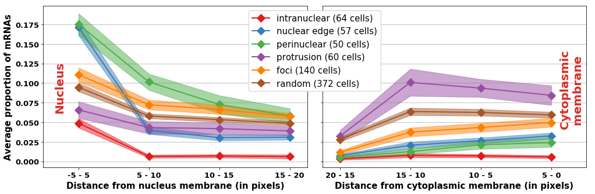

# Method, plots and results from Chouaib et al. (2020)

This repository gathers the code used to explore and analyze a large part of the images from the following paper: 

>__Paper:__ A localization screen reveals translation factories and widespread co-translational protein targeting  
__Authors:__ Racha Chouaib1,2,3,11,+, Adham Safieddine1,2,3,+, Xavier Pichon1,2,+, Arthur Imbert4,5,6,+, Oh Sung Kwon7, Aubin Samacoits8,9, Abdel-Meneem Traboulsi1,2, Marie-Cécile Robert1,2, Nikolay Tsanov1,2, Emeline Coleno1,2, Ina Poser10, Christophe Zimmer8,9, Anthony Hyman10, Hervé Le Hir7, Kazem Zibara3,11, Marion Peter1,2, [Florian Mueller](mailto:muellerf.research@gmail.com)8,9,* , [Thomas Walter](mailto:thomas.walter@mines-paristech.fr)4,5,6,* , [Edouard Bertrand](mailto:edouard.bertrand@igmm.cnrs.fr)1,2,*
>
>>1Institut de Génétique Moléculaire de Montpellier, University of Montpellier, CNRS, Montpellier, France  
2Equipe labélisée Ligue Nationale Contre le Cancer, University of Montpellier, CNRS, Montpellier, France  
3ER045, PRASE, DSST, Lebanese University, Beirut, Lebanon  
4MINES ParisTech, PSL-Research University, CBIO-Centre for Computational Biology, 77300 Fontainebleau, France  
5Institut Curie, 75248 Paris Cedex, France  
6INSERM, U900, 75248 Paris Cedex, France  
7Institut de biologie de l'Ecole normale supérieure (IBENS), Ecole normale supérieure, CNRS, INSERM, PSL Research University, 46 rue d'Ulm, 75005, Paris, France  
8Unité Imagerie et Modélisation, Institut Pasteur and CNRS UMR 3691, 28 rue du Docteur Roux, 75015 Paris; France  
9C3BI, USR 3756 IP CNRS – Paris, France  
10MPI-CBG, Pfotenhauer Str. 108, 01307 Dresden, Germany  
11Biology Department, Faculty of Sciences-I, Lebanese University, Beirut, Lebanon  
>
>+Equal contributions  
*To whom correspondence should be addressed.

This paper provides cell-level qualitative and quantitative evidence about the non-random localization of several mRNAs within the cytoplasm. More specifically it emphasizes the **co-localization of several mRNAs with relative proteins** and the fact that **some mRNAs are translated in factories**.

## Data

Our entire dataset consists in 527 images. Three different channels were used:
- Dapi channel to label nuclei.
- FISH channel to spot mRNA molecules of a targeted gene.
- GFP channel to spot related proteins.

Each image is a 4D tensor (one channel dimension and three spatial dimensions). The following pipeline mainly exploits dapi and FISH channel, although some measures and observations required the GFP channel. Ultimately, we identified 9710 cells within these images for 32 different genes. 

| 2D projection of dapi channel | 2D projection of FISH channel |
| ------------- | ------------- |
|  |  |

If you have any question relative to the image acquisition, please contact [Edouard Bertrand](mailto:edouard.bertrand@igmm.cnrs.fr)

## Pipeline

The pipeline is made up of three different resources:
- **BigFISH**, a python library to manipulate FISH images, apply segmentation and detection algorithms, then compute spatial features at the cell-level. Except for nuclei segmentation and final results computation, the full pipeline is based on BigFISH. As the library is not public yet, the actual version used for this paper is directly integrated in this repository.
- [**NucleAIzer**](http://nucleaizer.org/), an online tool for nuclei segmentation. We actually scale it using a modified version of their open-sourced code.
- A more general environment with classic data science libraries to train classification models, perform statistical tests and plot results. 

### Projections

### Filtering

### Nuclei segmentation

#### NucleAIzer

#### Two-round segmentation

### Cell segmentation

### mRNAs detection

#### Spot detection

#### Cluster decomposition

#### Foci detection

### Postprocessing

### Cell extraction

### Hand-crafted features

### Localization pattern classification

| Foci | Intranuclear | Nuclear | Perinuclear | Protrusion |
| ------------- | ------------- | ------------- | ------------- | ------------- |
|  |  |   |  |  |

### Visualization

## Results

## References

